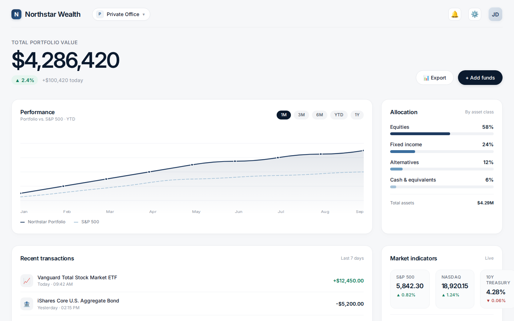
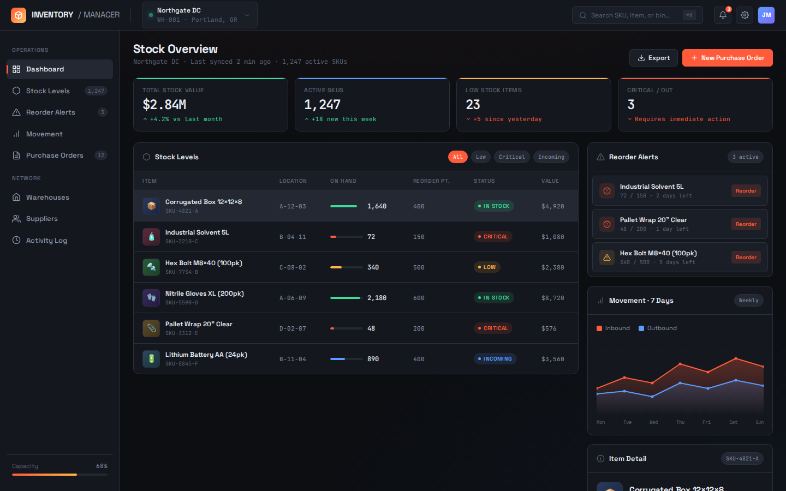
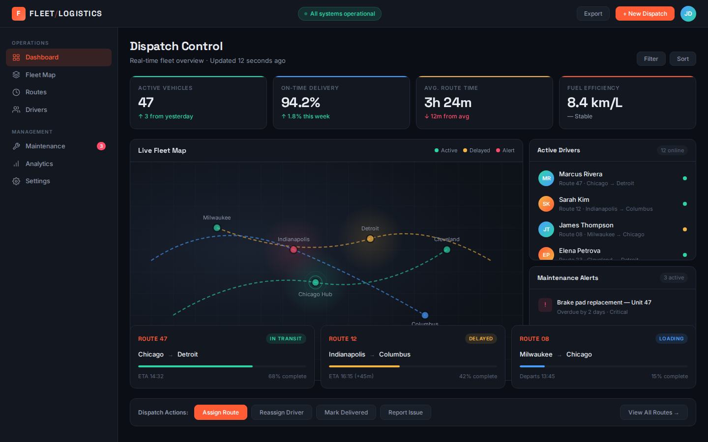
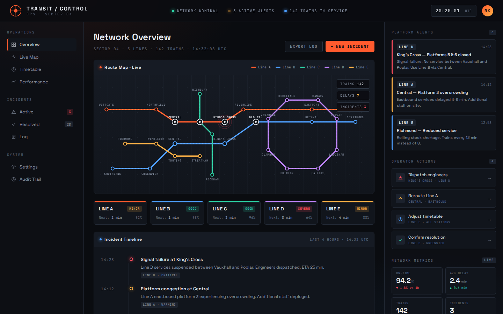

# DeepSeek-V4.1 Flash Showcase

[](https://github.com/sponsors/ajay9o9)
[](https://ajay9o9.github.io/DeepSeek-V4.1-Flash-showcase/)
[](https://x.com/ItsmeAjayKV)

100 websites, one sample each, generated with **DeepSeek-V4.1-Flash** via the
official API. Same gallery theme as [Qwen3.8 Showcase](https://ajay9o9.github.io/Qwen3.8-showcase/):
cards, live HTML, presentation mode. Three.js scenes are not part of this repo.

**[Open the live DeepSeek-V4.1 Flash Showcase ↗](https://ajay9o9.github.io/DeepSeek-V4.1-Flash-showcase/)** — browse the generated websites, click any card to open the original page, or use the presentation view.

<p align="center">
  <a href="https://ajay9o9.github.io/DeepSeek-V4.1-Flash-showcase/"></a>
  <a href="https://ajay9o9.github.io/DeepSeek-V4.1-Flash-showcase/"></a>
  <a href="https://ajay9o9.github.io/DeepSeek-V4.1-Flash-showcase/"></a>
  <a href="https://ajay9o9.github.io/DeepSeek-V4.1-Flash-showcase/"></a>
</p>

Local preview (after export):

```bash
python3 -m http.server 8000 --directory docs
```

Open http://127.0.0.1:8000/.

## Prompts

- [`PROMPTS.md`](PROMPTS.md) — readable
- [`prompts.json`](prompts.json) — machine-readable

Each page is one sample from that user prompt plus the shared system prompt.

## What is included

The public gallery only includes pages listed in `catalog.json`. The current
entry is `deepseek-v41-flash`, sourced from the compare tag
`deepseek-v4.1-flash` (all 100 web tasks).

## Re-export from the benchmark checkout

```bash
python3 tools/export_showcase.py \
  --source-root /media/aj-homeserver/windows/krea2-model/qwen-3.8/compare \
  --catalog catalog.json \
  --output docs \
  --clean
```

Optional picker (include/exclude screenshots):

```bash
python3 tools/pick_showcase.py
```

Then commit `docs/` and publish Pages from `main` / `/docs`.

## GitHub Pages

Same path as the Qwen gallery (no Actions required):

1. Push `main` including `docs/`.
2. Repo **Settings → Pages**.
3. Deploy from a branch: `main` / folder `/docs`.
4. Site: `https://<user>.github.io/<repo>/`.
